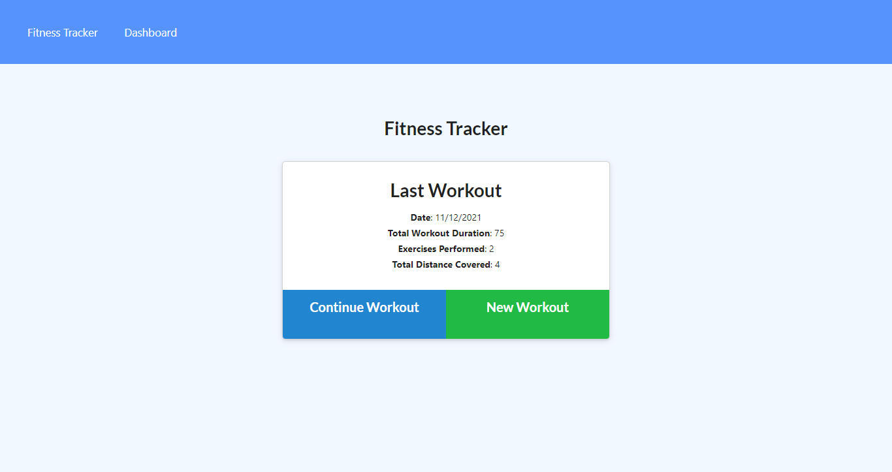
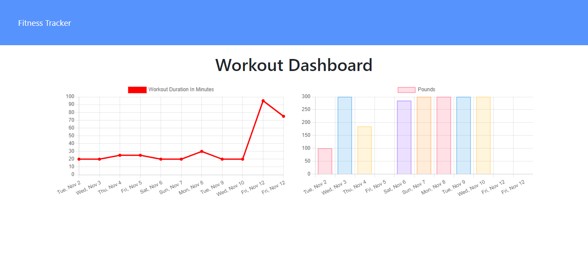

# NoSQL Fitness Tracker
Bootcamp Homework #18

## Description 
I have created a Fitness Tracker that helps users track their exercises. On the main page users can add a new workout or update a current workout to include more exercises. Exercises can include resistance or cardio and allows user to input values for duration, distance, weight, reps, and sets. The app also provides graphs of duration and weight lifted over the past 7 workouts. 
    
## Table of Contents

- [Installation](#installation)
- [Usage](#usage)
- [License](#license)
- [Contributions](#contributions)
- [Link](#link) 
- [Technologies](#technologies)
- [Questions](#questions)

## Installation
This application requires Node therefore users should run "npm install" in their command line prior to use. 

## Usage

Here is a screen shot of the landing page for the app:

Here is a screen shot of the Dashboard page for the app:

## License
This project licensed under the [MIT License](https://opensource.org/licenses/MIT).

## Contributions
Please contact me at <ljhofer@gmail.com> to discuss contributions.

## Link

[Link to deployed on Heroku.](https://ljhofer-fitness-tracker.herokuapp.com/)

[Link to project's GitHub repo.](https://github.com/ljhofer/nosql-fitness-tracker)

## Technologies
The program uses HTML, CSS, JavaScript, Node, Express, Mongo, and Mongoose.

## Questions
Please email any questions to <ljhofer@gmail.com> or reference my [GitHub profile](https://github.com/ljhofer). 